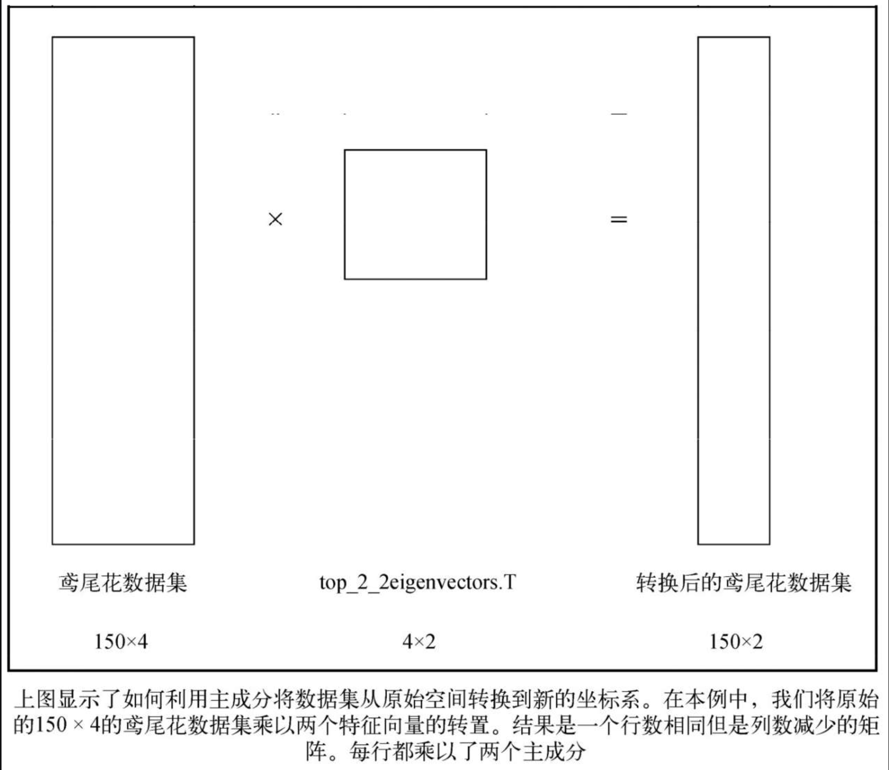
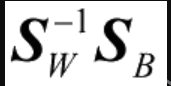

# Chp6
* 探索性数据分析：在应用机器学习流水线，甚至在使用机器学习算法或特征工程工具之前，我们理应对数据集进行一些基本的描述性统计，并进行可视化操作，以便
更好地理解数据的性质。
* 特征理解：在了解了数据的大小和形状后，应该进一步仔细观察数据集的每一列（如果有可能的话）和大致特点，包括数据的等级，因为这会决定如何清洗数据。
* 特征增强：这个阶段是关于改变数据值和列的，我们根据数据的等级填充缺失值，并按需执行虚拟变量转换和缩放操作。
* 特征构建：在拥有可以得到的最好数据集之后，可以考虑构建新的列，以便理解特征交互情况。
* 特征选择：在选择阶段，用所有原始和新构建的列进行（通常是单变量）统计测试，选取性能最佳的特征，以消除噪声影响、加速计算。
* 特征转换是一组矩阵算法，会在结构上改变数据，产生本质上全新的数据矩阵。**其基本思想是，数据集的原始特征是数据点的描述符/特点，也应该能创造一组新的
特征，用更少的列来解释数据点，并且效果不变，甚至更好。**
## 6.1 维度缩减：特征转换、特征选择与特征构建
* 特征选择仅限于从原始列中选择特征；特征转换算法则将原始列组合起来，从而创建可以更好地描述数据的特征。因此，特征选择的降维原理是隔离信号列和忽略噪声列。
* 特征转换方法使用原始数据集的隐藏结构创建新的列，生成一个全新的数据集，结构与之前不同。这些算法创建的新特征非常强大，只需要几个就可以准确地解释整个
数据集。
* 特征构造用几个列之间的简单操作（加法和乘法等）构造新的列。意思是，经典特征构造过程构造出的任何特征都只能用原始数据集中的几个列生成。如果我们的目标
是创造足够多的特征，捕获所有可能的特征交互，那么也许会生成大量额外的列。
* 特征转换方法可以用每个列中的一点点特征创建超级列，所以不需要创建很多新特征就可以捕获所有潜在的特征交互。因为特征转换算法涉及矩阵和线性代数，所以不会
创造出比原有列更多的列，而且仍能提取出原始列中的结构。
## 6.2 主成分分析
* 主成分分析（PCA，principal components analysis）是将有多个相关特征的数据集投影到相关特征较少的坐标系上。这些新的、**不相关的特征**
（之前称为超级列）叫主成分。主成分能替代原始特征空间的坐标系，需要的特征少、捕捉的变化多。
    + **主成分会产生新的特征，最大化数据的方差**。这样，每个特征都会解释数据的形状。主成分按可以解释的方差来排序，第一个主成分最能解释数据的方差，
    第二个其次。
### 6.2.1 PCA的工作原理
* PCA利用了协方差矩阵的特征值分解。**PCA也可以在相关矩阵上使用。如果特征的尺度类似，那么可以使用相关矩阵；尺度不同时，应该使用协方差矩阵。** 一般
建议在缩放数据上使用协方差矩阵。
    + 这个过程分为4步：
        - 创建数据集的协方差矩阵；
        - 计算协方差矩阵的特征值；
        - 保留前k个特征值（按特征值降序排列）；
        - 用保留的特征向量转换新的数据点。
### 6.2.2 鸢尾花数据集的PCA——手动处理
* 碎石图是一种简单的折线图，显示每个主成分解释数据总方差的百分比。要绘制碎石图，需要对特征值进行降序排列，绘制每个主成分和之前所有主成分方差的和。
* 特征值分解总是会产生和特征一样多的特征向量。我们需要在计算完毕后选择希望使用的主成分数量。这表示PCA和本书中大部分算法一样是半监督的，需要一些人为
输入。
* 通过这些主成分向量，我们可以将iris_X（原始特征集）和top_2_eigenvectors（PCA得到的top2主成分）两个矩阵相乘，将数据投影到改进后的超级数据集中。
下图显示了这个过程。
    + 
    + 这样就完成了。我们将四维的鸢尾花数据集转换成了只有两列的新矩阵，而这个新矩阵可以在机器学习流水线中代替原始数据集。
### 6.2.3 scikit-learn的PCA
* scikit-learn的PCA会在预测阶段自动将数据中心化，从而改变结果。
```python
# 手动中心化数据，模仿scikit-learn的PCA
np.dot(iris_X-mean_vector, top_2_eigenvectors.T)[:5,]

array([[-2.68420713, -0.32660731],
        [-2.71539062,   0.16955685],
        [-2.88981954,   0.13734561],
        [-2.7464372 ,   0.31112432],
        [-2.72859298, -0.33392456]])
```
* 在原始数据集中，我们可以在前两列的原始特征空间中看见这些鸢尾花。但是在投影后的空间内，各种花分离得更远，而且旋转了一点。数据聚类看上去更突出了。
这是因为我们的主成分尽可能捕捉了数据的方差，并在图中展示。    
* PCA的主要优点之一：消除相关特征。
    - 本质上，在特征值分解时，得到的所有主成分都互相垂直，意思是彼此线性无关。
    - 因为很多机器学习模型和预处理技术会假设输入的特征是互相独立的，所以消除相关特征好处很大。我们可以用PCA确保这一点。    
### 6.2.4 中心化和缩放对PCA的影响
* 和前面用过的很多转换方法一样，特征的缩放对于转换往往极其重要。PCA也不例外。上面说到，scikit-learn的PCA在预测阶段会将数据进行**中心化
（centering）**，但为什么不是在拟合时进行？如果scikit-learn的PCA要在预测时添加一步数据中心化的操作，那为什么不在计算特征向量时就完成？我们的假设
是：将数据中心化不会影响主成分。下面进行验证。   
* 在PCA处理之前对原始特征集进行**中心化处理**，PCA得到的主成分的特征值和不标准化处理的结果一致。这是因为，原始矩阵和中心化后矩阵的协方差矩阵相同。
如果两个矩阵的协方差矩阵相同，那么它们的特征值分解也相同。因此，scikit-learn的PCA不会对数据进行中心化，因为无论是否进行中心化操作，结果都一样。
    - 中心化处理：`X_centered = StandardScaler(with_std=False).fit_transform(iris_X))` 
    - 上面代码中with_std=False表示不进行标准差缩放，即只是对数据减去均值，而不对数据进行除以标准差的操作。如果将with_std的值改为True，则会
    对数据进行标准差缩放，即将数据除以标准差。
    - 如果StandardScaler的with_std采用默认的True参数，即(x-mean)/std，那么PCA得到的主成分的特征值会改变，这是因为对数据进行缩放后（指
    除以标准差），列与列的协方差会更加一致（个人理解为标准化后列的分布不变，但量纲统一了，因此相关程度会变大，即协方差变大），而且每个主成分解释的
    方差会变得分散，而不是集中在一个主成分中。   
### 6.2.5 深入解释主成分
## 6.3 线性判别分析
* 线性判别分析（LDA，linear discriminant analysis）是特征变换算法，也是有监督分类器。LDA一般用作分类流水线的预处理步骤。和PCA一样，LDA的
目标是提取一个新的坐标系，将原始数据集投影到一个低维空间中。
* 和PCA的主要区别在于，LDA不会专注于数据的方差，而是优化低维空间，以获得最佳的类别可分性。意思是，新的坐标系在为分类模型查找决策边界时更有用，非常
适合用于构建分类流水线。
    - LDA极为有用的原因在于，基于类别可分性的分类有助于避免机器学习流水线的过拟合，也叫防止维度诅咒。LDA也会降低计算成本。
### 6.3.1 LDA的工作原理
* LDA和PCA一样可以作为降维工具使用，但并不会计算整体数据的协方差矩阵的特征值，而是计算类内（within-class）和类间（between-class）散布矩阵的
特征值和特征向量。LDA分为5个步骤：
    + 计算每个类别的均值向量；
    + 计算类内和类间的散布矩阵；
    + 计算的特征值和特征向量；
    + 降序排列特征值，保留前k个特征向量；
    + 使用前几个特征向量将数据投影到新空间。
### 6.3.2 在scikit-learn中使用LDA
* LDA其实是伪装成特征转换算法的分类器。和PCA的无监督计算（不需要响应变量）不同，**LDA会尝试用响应变量查找最佳坐标系，** 尽可能优化类别可分性。
这意味着，LDA只在响应变量存在时才可以使用。
* LDA也会和PCA一样去除特征的相关性。
* 需要注意的是，LDA的scalings_属性并不像PCA的那样1∶1对应坐标系。因为scalings_的目的不是创造新的坐标系，而是指向可以优化类别可分性的最佳方向。
* **PCA和LDA的主要区别在于：PCA是无监督方法，捕获整个数据的方差；而LDA是有监督方法，通过响应变量来捕获类别可分性。**
    - PCA和LDA的主要区别在于：PCA是无监督方法，捕获整个数据的方差；而LDA是有监督方法，通过响应变量来捕获类别可分性。
## 6.4 LDA与PCA：使用鸢尾花数据集
## 6.5 小结
* PCA和LDA都是很强大的工具，但也有局限性。这两个工具都是线性转换，所以只能创建线性的边界，表达数值型数据。它们也是静态转换。无论输入什么，LDA和PCA
的输出都是可预期的，而且是数学的。如果数据不适合PCA或LDA（数据有非线性特征，例如是圆形的），那么无论我们怎么进行网格搜索，这些算法都不会有什么帮助。


     