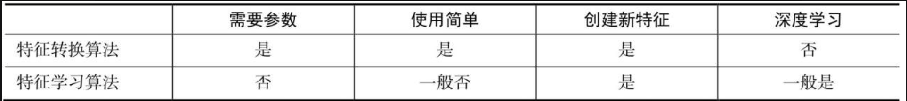
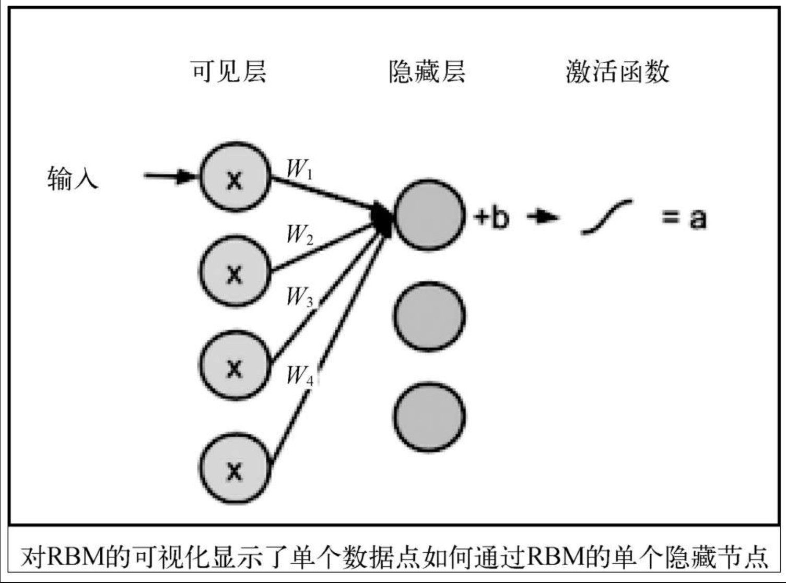
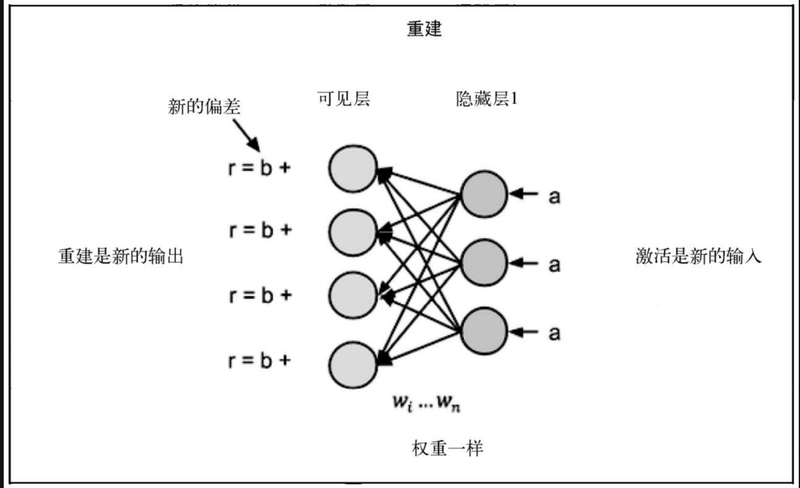

## 7.1 数据的参数假设
* 特征学习算法希望可以去除这个参数假设，从而解决该问题。这些算法不会对输入数据的形状有任何假设，而是依赖于随机学习（stochastic learning）。意思是，这些算法并不是每次输出相同的结果，而是一次次按轮（epoch）检查数据点以找到要提取的最佳特征，并且拟合到一个解决方案（在运行时可能会有所不同）。
* 
### 7.1.1 非参数谬误
### 7.1.2 本章的算法
* 受限玻尔兹曼机（RBM）：
  + 一种简单的深度学习架构，根据数据的概率模型学习一定数量的新特征。这些机器其实是一系列算法，但scikit-learn中只实现了一种。BernoulliRBM可以作为非参数特征学习器，但是顾名思义，这个算法对单元格有一些假设。
* 词嵌入：
  + 可以说是深度学习在自然语言处理/理解/生成领域最近进展的主要推动者之一。词嵌入可以将字符串（单词或短语）投影到n维特征集中，以便理解上下文和措辞的细节。我们用Python的gensim包准备词嵌入，然后借助预训练过的词嵌入来研究它能如何增强我们与文本的交互能力。
## 7.2 受限玻尔兹曼机
* RBM是一组无监督的特征学习算法，使用概率模型学习新特征。与PCA和LDA一样，我们可以使用RBM从原始数据中提取新的特征集，用于增强机器学习流水线。在RBM提取特征之后使用线性模型（线性回归、逻辑回归、感知机等）往往效果最佳。    
  - RBM是一个浅层（两层）的神经网络，属于深度信念网络（DBN，deep belief network）算法的一种。用标准的术语讲，这个网络有一个可见层（第一层），后面是一个隐藏层（第二层）。
  - 隐藏层的节点数是人为选取的，代表我们想学习的特征数。
### 7.2.1 不一定降维
* PCA和LDA对可以提取的特征数量有严格的限制。对于PCA，我们受限于原始特征的数量（只能使用等于或小于原始特征数的输出），而LDA的要求更加严格，只能输出类别的数量减1。
* RBM可以学习的特征数量只受限于计算机的计算能力，以及人为的解释。RBM可以学习到比初始输入更少或更多的特征。具体要学习的特征数量取决于要解决的问题，可以进行网格搜索。
### 7.2.2 受限玻尔兹曼机的图
* 
  - 该计算也可以用数据的输入向量和权重向量的点积表示。最终的加权结果会加上一个偏差变量，并通过激活函数（一般使用S形函数）。结果储存在名称为a的变量中。
* 因为来自每个可见节点的输入会传递到所有的隐藏节点，所以RBM也可以被定义为对称的二分图。对称是因为可见节点都和所有的隐藏节点相连接。二分图表示有两个部分（两层）。
### 7.2.3 玻尔兹曼机的限制
* 通过上图，我们看见了层与层之间的连接（层间连接），但没有看见同一层内节点的连接（层内连接）。这是因为没有这种连接。RBM的限制是，不允许任何层内通信。这样，节点可以独立地创造权重和偏差，最终成为（希望是）独立的特征。
### 7.2.4 数据重建
* 在网络的前向传导中，我们看见数据可以向前通过网络（从可见层到隐藏层），但是这并不能解释为什么RBM可以不依赖真实值而学习新特征。**RBM的学习来自于可见层和隐藏层间的多重前后向传导。**
  + 在重建阶段，*我们调转网络，把隐藏层变成输入层，用相同的权重将激活变量（a）反向传递到可见层，但是偏差不同。*
  + *然后，用前向传导的激活变量重建原始输入向量。* 下图显示了如何使用相同的权重和不同的偏差，通过网络进行反向激活。
    - 
  + **RBM用这种方式进行自我评估。通过将激活信息进行后向传导并获取原始输入的近似值，该网络可以调整权重，让近似值更接近原始输入。** 在训练开始时，由于权重是随机初始化的（标准做法），近似值有可能相差很大。然后，通过反向传播（和前向传导的方向相同，的确很绕）调整权重，最小化原始输入和近似值的距离。我们重复这个过程，直到近似值尽可能接近原始的输入。_这个过程发生的次数叫作迭代次数。
  + 这个过程是一种**生成性学习**，试图学习一种可以生成原始数据的概率分布，并且利用知识来提取原始数据的新特征集。
  + 例如，给定一个数字（0～9）的图片，并要求按数字进行分类。这个网络的前向传导会问：给定这些像素，应该是什么数字？后向传导时，网络会问：给定一个数字，应该出现哪些像素？**这称为联合概率**，即“给定x时有y”和“给定y时有x”共同发生的概率，也是网络两个层的共享权重。
### 7.2.5 MNIST数据集
* 主要区别是，此处使用很低级的特征，而不是解释性很好的特征。
## 7.3 伯努利受限玻尔兹曼机
* scikit-learn中唯一的RBM实现是BernoulliRBM，因为它对原始数据的范围进行了约束。伯努利分布要求数据的值为0～1。scikit-learn的文档称，该模型假定输入是二进制的值，或者是0～1的数。这个限制是为了表示节点的值就是节点被激活的概率，从而可以更快地学习特征集。
### 7.3.1 从MNIST中提取PCA主成分
### 7.3.2 从MNIST中提取RBM特征
## 7.4 在机器学习流水线中应用RBM
### 7.4.1 对原始像素值应用线性模型
### 7.4.2 对提取的PCA主成分应用线性模型
### 7.4.3 对提取的RBM特征应用线性模型
* 面对非常复杂的任务（例如图像识别、音频处理和自然语言处理），特征学习算法很有效。这些大数据集有很多隐藏的特征，难以通过线性变换（如PCA或LDA）提取，但是非参数算法（如RBM）可以。
## 7.5 学习文本特征：词向量
## 7.6 小结
